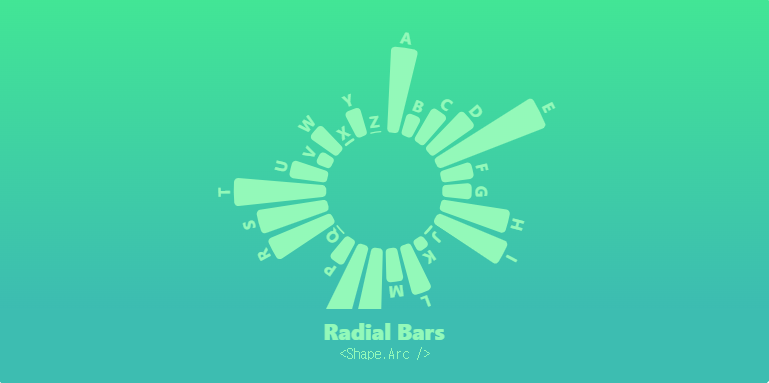

# visx 

airbnb 팀이 D3.js 와 react 를 사용해 만든 라이브러리인 visx 를 연습하기 위한 사이트입니다.

https://airbnb.io/visx


---

## 📦사용 방법
저장소 클론
```
git clone https://github.com/h2s0/visx.git
```
1. 저장소 클론
2. `pnpm i`로 의존성 설치
3. `pnpm dev` 로 localhost 활성화


## 🪄 구현 예상 목록


